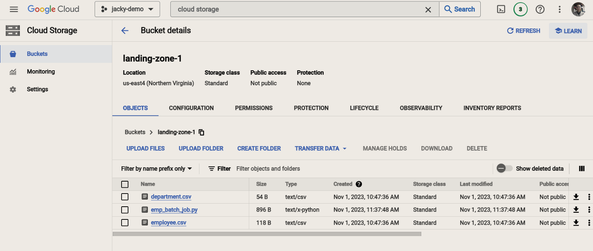
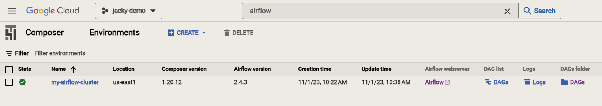
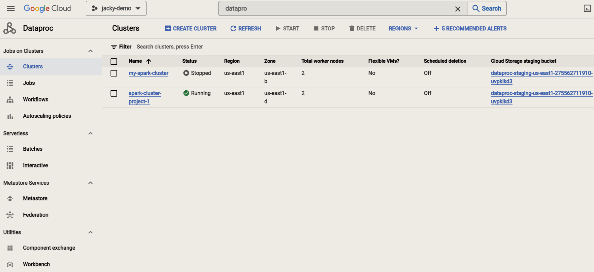
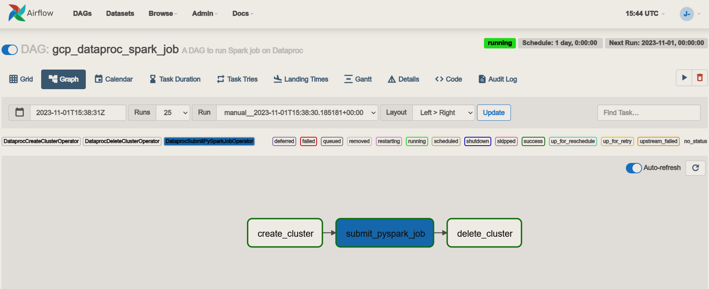
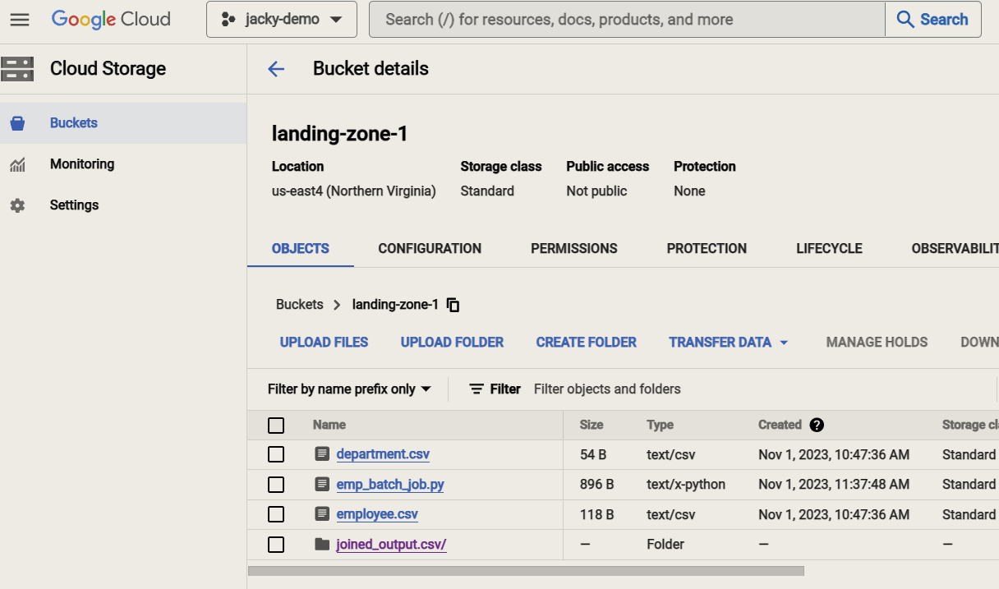
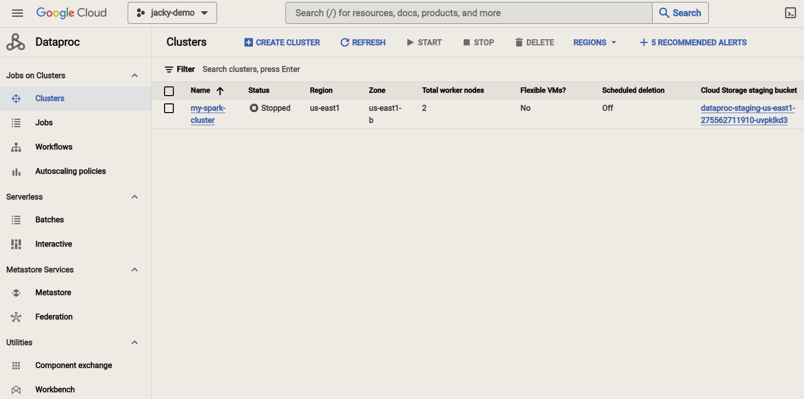

# Submit PySpark job to Spark Cluster Using Airflow

## Introduction

This repository provides a streamlined and efficient method for submitting PySpark jobs to a Dataproc Spark cluster using Google Composer, a managed Apache Airflow service. Dataproc is a fully managed cloud service for running Apache Spark and Hadoop clusters, and Airflow is an open-source platform that allows you to programmatically author, schedule, and monitor workflows. By combining the power of Dataproc and Airflow, you can automate and orchestrate your PySpark jobs on a Dataproc cluster, making it easier to manage, schedule, and monitor your big data processing tasks.

Whether you need to process large datasets, perform complex data transformations, or run machine learning models on your data, this repository provides code examples to help you get started with submitting PySpark jobs to a Dataproc cluster using Composer. By leveraging these technologies, you can unlock the potential of distributed data processing and take full advantage of the cloud's scalability and resources for your big data workloads.

## Project Contents

- **data**: This directory contains the dataset to be processed.
- **pyspark_jobs**: This directory contains the pyspark driver program to be submmited to a Dataproc cluster
- **airflow_dags**: The DAG definition in stored in this directory.

## Prerequisite

You need to have a Google Cloud account to get started.

## Getting Started

1. Create a new project `jacky-demo` and record its `ID` (which you may have to make changes in `airflow_spark_job.py`)
2. Search for `Composer` service and create a new composer. Provide any name you prefer (or `my-airflow-cluster` in my case) and necessary information.
3. Search for `Cloud Storage` service and create a new bucket named `landing-zone-1`. (You may need to use other names and make changes to the configuration in the code accordingly)
4. Upload `emp_batch_job.py`, `employee.csv` and `department.csv` to the bucket.

    

5. Click on `DAGs` under label `DAGs folder` and upload `airflow_spark_job.py`

    

## Results

- A new cluster named `spark-cluster-project-1` is created on the fly as the first task in the Airflow pipeline.

    

- PySpark job has been submitted and executed in the newly created cluster as the second task in the Airflow DAG.

    

- The datasets have been processed and the result is stored in the downstream bucket (the same bucket to simplify steps).

    

- The newly created cluster has been deleted as the last task in the DAG.

    

